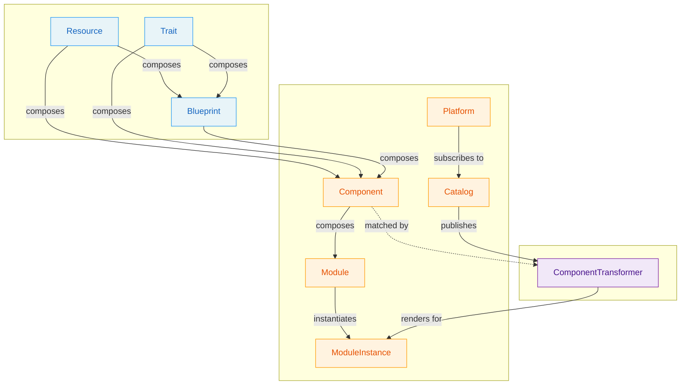

# OPM Definition Types

OPM organizes its types into four families: **Primitives**, **Constructs**, **Adapters**, and **Publish gates**.

**Primitives** are schema contracts — independently authored building blocks that define *what* exists, *how* it behaves, and *what reusable pattern* applies. They share the same shape (`metadata` + `spec`), each carries an `apiVersion` and a contract-keyed identity, and they are composed into Constructs.

**Constructs** are framework types — they organize, compose, deploy, and verify the application model. They consume Primitives but don't define schemas for composition themselves.

**Adapters** are the translation layer between the application model and a target runtime. They describe how Components render into target-specific resources. Adapters consume Constructs and Primitives but live outside the composition hierarchy, and they carry no `apiVersion` — an adapter's inputs are other people's contracts, so a contract level has no referent.

**Publish gates** are definitions a publishing tool unifies an artifact against, so the diagnostic an author reads is CUE's own rather than a hand-rolled comparison that drifts from the schema. A gate is not part of any artifact; it is a rule *about* artifacts, shipped in the same module as the shapes it constrains.

### Litmus Test

> **Does a module attach it and write values against its `spec`?** → **Primitive**
>
> **Does it organize, compose, or deploy the model?** → **Construct**
>
> **Does it bridge the model to a target runtime?** → **Adapter**
>
> **Is it a rule about artifacts that a publishing tool unifies against?** → **Publish gate**

The primitive question is *not* "does it introduce new schema vocabulary?" Under that older reading `#Blueprint` sat with the constructs, because its `spec` only composes fields its Resources and Traits already declare — yet a module names a blueprint, writes values under it, and is broken by a change to it exactly as it is by a change to a Resource. What the split has to track is which definitions carry a **contract key** and the additive-only promise that key gates, and that is decided by whether a module writes against the thing (enhancement 0010 D44).

## Summary

| Type | Family | Question It Answers | Level |
|------|--------|---------------------|-------|
| [**Resource**](primitives.md#resource) | Primitive | "What must exist?" | Component |
| [**Trait**](primitives.md#trait) | Primitive | "How does it behave?" | Component |
| [**Blueprint**](primitives.md#blueprint) | Primitive | "What is the reusable pattern?" | Component |
| [**Component**](constructs.md#component) | Construct | "What composes primitives?" | Module |
| [**Module**](constructs.md#module) | Construct | "What is the application?" | Top-level |
| [**ModuleInstance**](constructs.md#moduleinstance) | Construct | "What is being deployed?" | Deployment |
| [**Catalog**](constructs.md#catalog) | Construct | "What vocabulary is published?" | Registry |
| [**Platform**](constructs.md#platform) | Construct | "Which catalog builds does this target subscribe to?" | Runtime |
| [**ComponentTransformer**](adapters.md#componenttransformer) | Adapter | "How does a component become a target resource?" | Runtime |
| **TraitOptionalGate** | Publish gate | "Did the catalog state an overridable posture?" | Publish |
| **IdentityPackage** | Publish gate | "Is this tree a conformant artifact?" | Publish |
| **CatalogMemberFQNGate** | Publish gate | "Does the authored key agree with identity?" | Publish |

## Decision Flowchart

1. **Does a module attach it and write values against its `spec`?**
    - Yes → It's a **Primitive**:
        1. Is this a standalone deployable thing? → **Resource**
        2. Does this modify how a Resource operates? → **Trait**
        3. Is this a reusable composition of Resources/Traits? → **Blueprint**
    - No → continue.
2. **Does it organize, compose, publish, or deploy the application model?**
    - Yes → It's a **Construct**. See [Constructs](constructs.md).
3. **Does it bridge the model to a target runtime?**
    - Yes → It's an **Adapter**. See [Adapters](adapters.md).
4. **Is it a rule a publishing tool unifies an artifact against, rather than part of any artifact?**
    - Yes → It's a **Publish gate**. See [SPEC.md §5](../SPEC.md).
